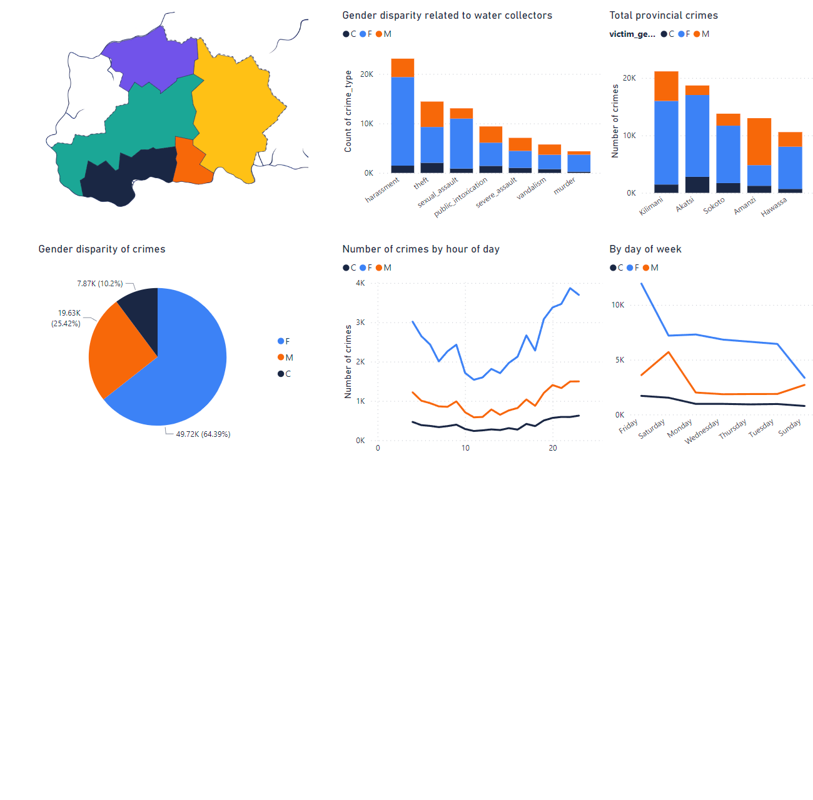

# **Maji Ndogo Data Analytics Project**

## **Overview**
Welcome to the **Maji Ndogo: Visualizing the Currents of Change** project! This analysis delves deep into water access, queue compositions, well pollution, and crime insights in the Maji Ndogo region. The project leverages advanced data analytics techniques to transform raw data into actionable insights, empowering better decision-making.

## **Project Goals**
- **Enhance Understanding of Water Access**: Analyze queue compositions and time spent at shared water sources.
- **Investigate Pollution Impact**: Visualize contamination levels in water sources and identify areas requiring intervention.
- **Link Crime to Water Access**: Identify how water-related crimes disproportionately affect women and children.
- **Inform Data-Driven Solutions**: Provide decision-makers with interactive dashboards for tailored interventions.

## **Tools and Technologies**
- **SQL**: Data cleaning, extraction, and preparation.
- **Power BI**: Interactive dashboards and visualizations.
- **Python**: Data preprocessing and statistical analysis.
- **Excel**: Data organization and early-stage analysis.

## **Key Visuals and Insights**

### **Queue Analysis**
- **Insight**: Women make up the majority of water collectors, yet face longer queue times during peak hours. 
- **Visualization**: Hourly queue trends, gender distribution, and total time spent in queues per province.

### **Well Pollution**
- **Insight**: Provinces like Akatsi have a significant number of chemically polluted wells, highlighting areas for urgent action.
- **Visualization**: Pollution maps showcasing clean, chemically, and biologically contaminated wells.

### **Crime Analysis**
- **Insight**: Women are twice as likely as men to be victims of water-related crimes, with incidents peaking on weekends and at night.
- **Visualization**: Crime distribution by gender, type, time of day, and province.

## **Challenges and Solutions**
- **Challenge**: Many-to-many relationships in the data model.
  - **Solution**: Created bridging tables and refined one-to-many relationships for accurate filtering and analysis.
- **Challenge**: Handling large datasets in Power BI.
  - **Solution**: Optimized data imports and streamlined queries to improve performance.

## **Acknowledgments**
This project was developed as part of the **ALX Data Analytics Program**. Special thanks to Explore AI Academy for providing the data and foundational guidance.
